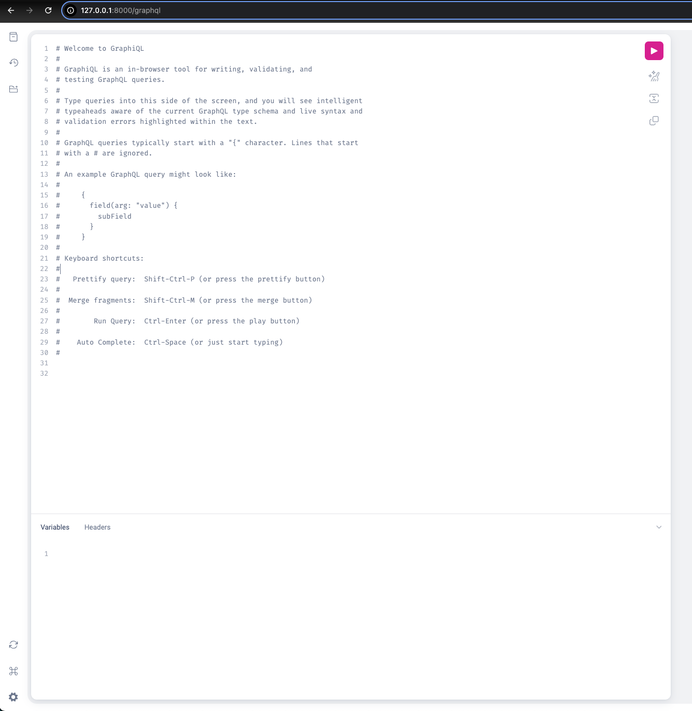
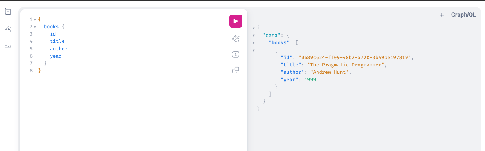
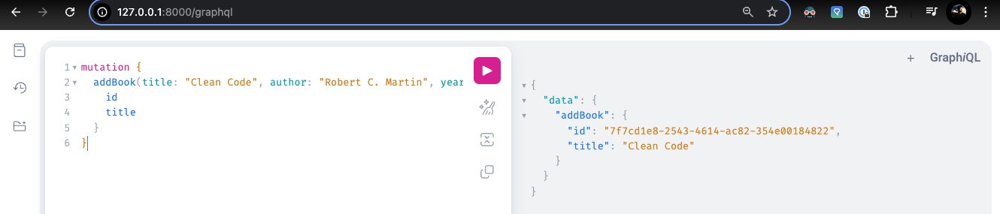
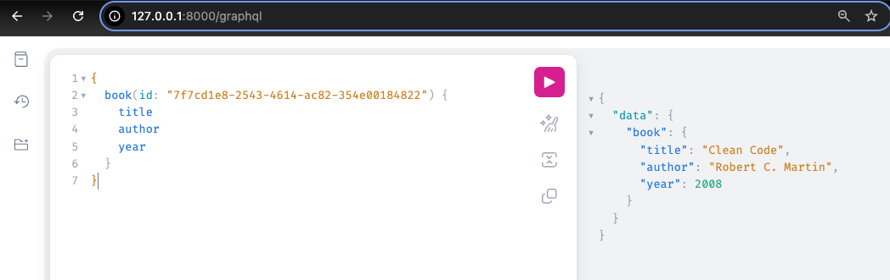
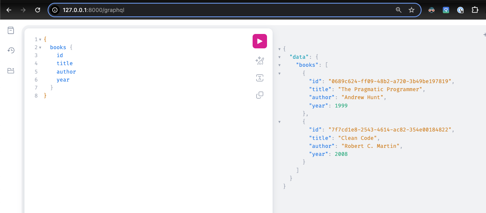

# FastAPI + Strawberry GraphQL — Books API


## What is GraphQL?
In simple terms, `GraphQL` is a query language for APIs. The client makes a request to a single URL and gets gets to choose exactly what they want.

The single URL is a single endpoint: `/graphql` instead of multiple REST API endpoints. All queries are routed through this single query that understands the Schema.

## Components of GraphQL
1. Schema - A strong rigid structure that defines the following:-
   1. Type - e.g. `book`, `author` and what fields they have
   2. Operations
      1. query - to read data
      2. mutation - to create, update, delete data
2. Resolver
Functions that fetch data or computes the value for a given field in your schema.

For example, 
- the `books` query calls a resolver. 
- Resolver returns list of `book` objects from database of in-memory store


## Quickstart
```bash
python -m venv .venv && source .venv/bin/activate   # Windows: .venv\Scripts\activate
pip install -r requirements.txt
cd GraphQL
uvicorn app.main:app --reload
```

## Running the app
Open GraphQL IDE at: http://127.0.0.1:8000/graphql

### List books

### Add a book (mutation)

### Get a book by id (copy an id from previous responses)

### List books again

