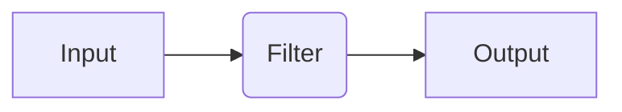
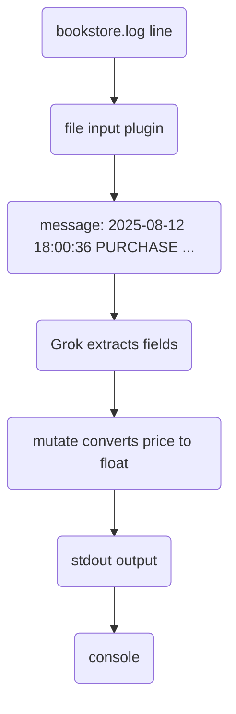

## Grok
`Grok` patterns are used for parsing log files. It is a **pattern matching** system built on REGEX. 

It takes unstructured logs and turns them into structured JSON by matching parts of log line into named patterns.

## Running the query
In this example, we have a sample `bookstore_logger.py` python script which generates random logs.

### Run the script
`python3 bookstore_logger.py`
Let it run 5-10 seconds
### Stop the script
`Ctrl + C` or `Cmd + C`

A `bookstore.log` file will be generated.

Sample Lines:-
```log
2025-08-12 18:00:36 PURCHASE book_id=BK102 price=6.37 customer="Evan Brooks"
2025-08-12 18:00:37 PURCHASE book_id=BK107 price=20.47 customer="Alice Johnson"
```

## Wiring up Logstash with Grok

The **Logstash pipeline** is basically


| Entity | Description |
|---|---|
| Input | where raw data comes from |
| Filter | how the data is transformed |
| Output | where the processed data goes |

### Install Logstash locally
```bash
brew tap elastic/tap
brew install logstash
```

## Create `logstash.conf` config file in the same folder
Check out [logstash.conf](logstash.conf)

### 1. Input Block
```conf
input {
  file {
    path => "/absolute/path/to/bookstore.log"
    start_position => "beginning"
    sincedb_path => "/dev/null"
  }
}
```
- `file` plugin: reads from your log file.
- `start_position` => `"beginning"` → read from start, not just new lines.
- `sincedb_path` => `"/dev/null"` → forgets where it left off (good for testing).

### 2. Filter Block
This is where we do the transformations.
```conf
grok {
  match => {
    "message" => "%{TIMESTAMP_ISO8601:timestamp} %{WORD:action} book_id=%{NOTSPACE:book_id} price=%{NUMBER:price} customer=\"%{DATA:customer}\""
  }
}
```
- Takes the raw log line (in the message field).
- Uses our Grok pattern to extract `timestamp`, `action`, `book_id`, `price`, and `customer`.

#### Mutating
By default, Grok converts all data types into string. Here we have `price` as string.
This can be changed by adding the following block in the `filter` section:-
```conf
mutate {
  convert => { "price" => "float" }
}
```
### 3. Output Block
```conf
output {
  stdout {
    codec => rubydebug
  }
}
```
- send processed events to console in pretty-printed JSON.
- in real life, you'd send it to ElasticSearch or something similar.

## Run Logstash
```bash
logstash -f %(pwd)/logstash.conf
```

## Output
```json
{
        "action" => "REFUND",
           "log" => {
        "file" => {
            "path" => "/Users/saikamat/Documents/Python Scripts/APIs/APIFrameworks/Grok/bookstore.log"
        }
    },
         "event" => {
        "original" => "2025-08-12 18:00:38 REFUND book_id=BK107 price=4.48 customer=\"Bob Lee\""
    },
     "timestamp" => "2025-08-12 18:00:38",
       "book_id" => "BK107",
         "price" => 4.48,
    "@timestamp" => 2025-08-12T16:00:38.000Z,
      "customer" => "Bob Lee"
}
```

## Visual Representation
