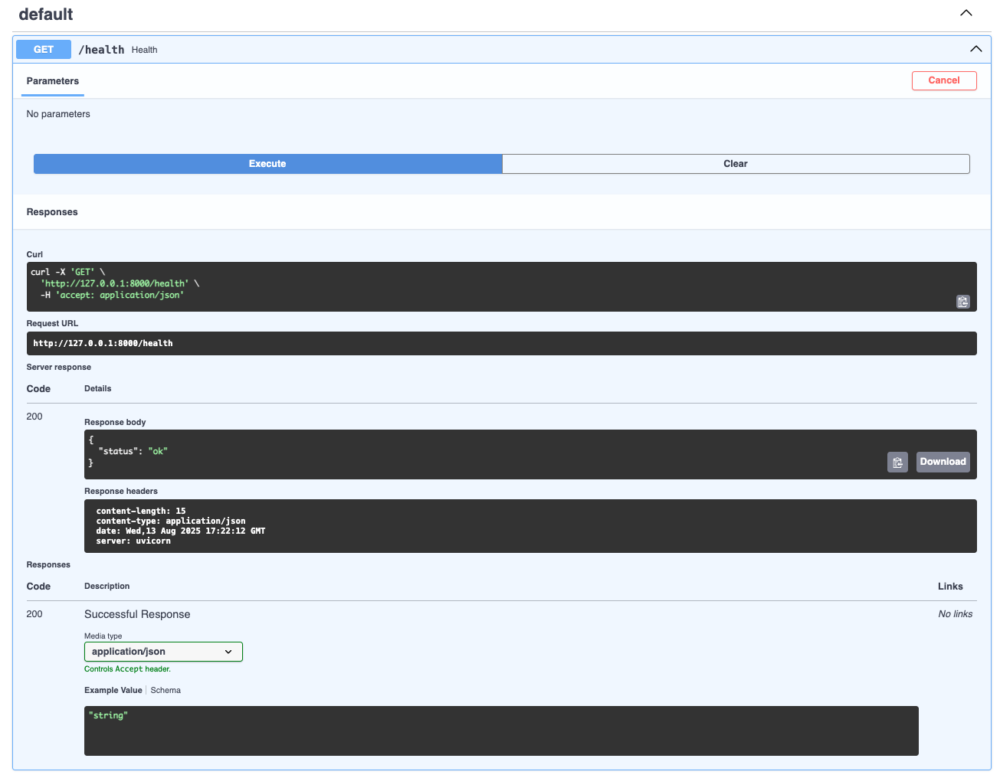

# KOMBO MINI APP
Kombo builds a unified API for HR Payroll & recruiting systems. 

## Analogy
Think of the operation connecting multiple devices into your laptop. Each device has various ways of connecting with your laptop, such as via RJ45, USB-B, USB-C, image Card, HDMI etc.

Kombi acts like a universal dock where all devices connect and all Kombi needs is a single endpoint into your laptop.

## Challenges
- Integrating with nearly 50+ APIs is painful
  
## Solution
- Abstract all into one consistent API
- **Normalization** and **Data Mapping** is crucial

# Logic
- `Providers` contains data from two different providers -> `Alpha` and `Beta`
- `schemas.py` is the **canonical model** i.e. the clean shape that your app will use
- `normalize.py` converts provider data into a **canonical model**


# Quickstart
```bash
# Python 3.10+ recommended
python3 -m venv .venv
source .venv/bin/activate
pip install -r requirements.txt
cd kombo-mini

uvicorn app.main:app --reload
```

# Output
Open at [http://localhost:8000/](http://localhost:8000)

Health Check

Employee List

Get Employee by ID
